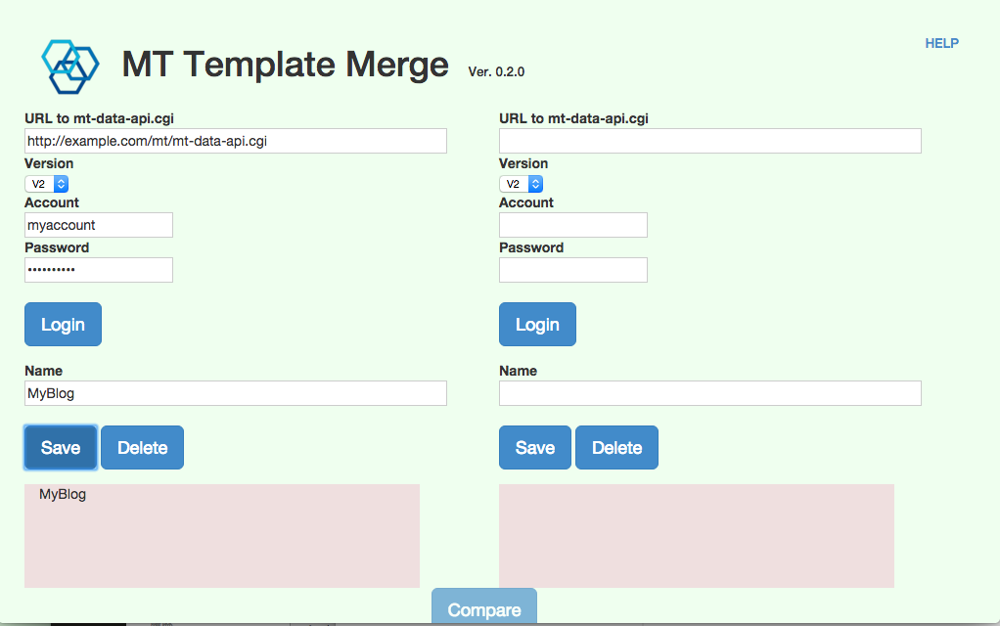

MTTemplateMerge
====

## 何ができるのか？
２つのMT(MovableType)にログインして、それぞれのテンプレートのソースコードを比較・編集することができます。

## 使い方

### ログイン画面

* URL

    data-apiのアドレスを入力します。例えば、

        http://example.com/mt/mt-data-api.cgi
    
    など。

* Version

    DATA-APIのバージョンを設定します。MT6.0.x系の場合はV1を、MT6.1以上の場合はV2を指定してください。
    また、V1の場合、MT側にテンプレート用のData-API機能を追加するプラグインを導入する必要があります。
    [MT-DataAPI-Templates](https://github.com/knight9999/MT-DataAPI-Templates)をMTに組み込んで下さい。

* Account/Password

    アカウントとパスワードを入力します。

* Loginボタン

    クリックすると、ログインできます。

* Name

    ログイン情報を再利用したい場合は、Nameに名前を書いてSaveボタンをクリックしてください。
    画面下に、ログイン情報が登録されます。

* Saveボタン

    ログイン情報を、Nameに入力した名前で登録します。

* Deleteボタン

    Nameで指定されたログイン情報を削除します。

* ログイン情報

    登録されているログイン情報です。クリックすると、その内容が反映されます。

### ソースコード

[https://github.com/knight9999/MTTemplateMerge](https://github.com/knight9999/MTTemplateMerge)

### License

All MTTemplateMerge code is Copyright 2016 by K. Naito.   
MTTemplateMerge is distributed under the LGPL open source licenses.

MTTemplateMerge utilizes [Mergely](http://www.mergely.com/), a third-party library released under the GPL, LGPL and MPL open source licenses.
Also used are CodeMirror released under an MIT license and jQuery released under the MIT or GPL Verrsion 2 license.
